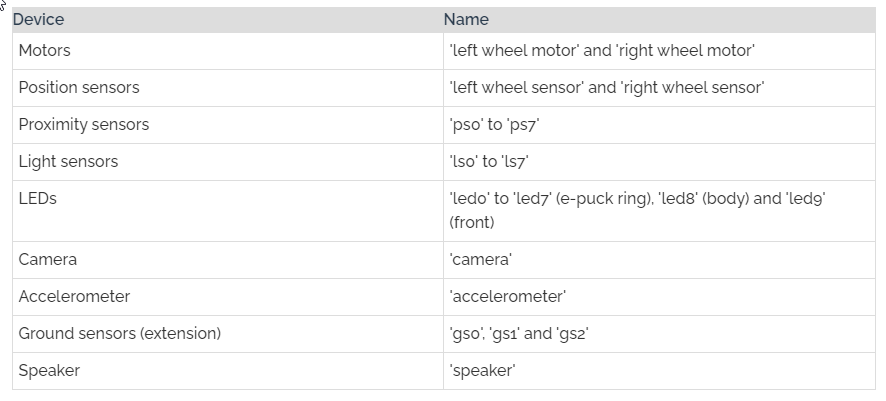
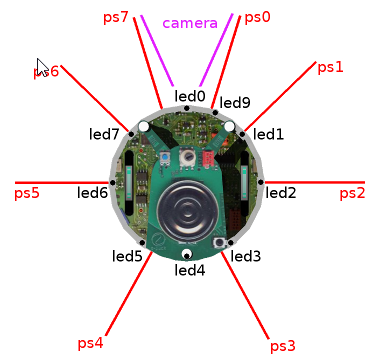
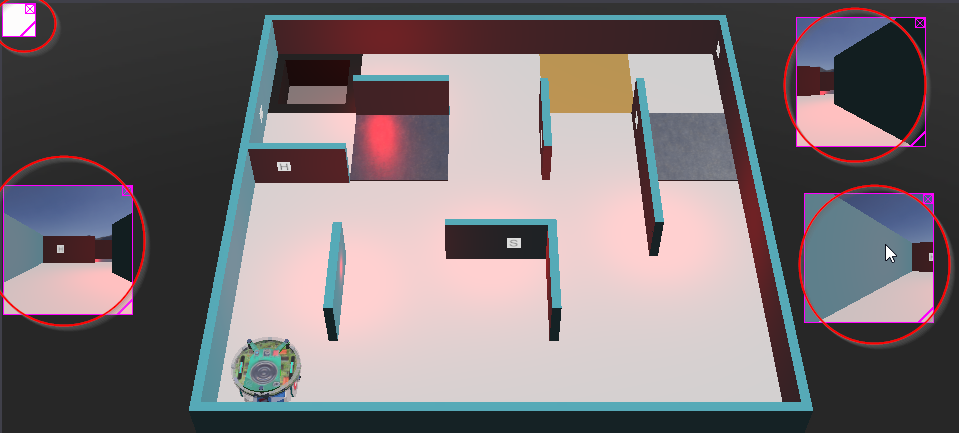

# Rescate

El simulador que vamos a utilizar es Webots versión 2020ar1.

Lo pueden bajar de este [link](https://github.com/cyberbotics/webots/releases/tag/R2020a-rev1)

El ambiente de simulación está en el mismo repositorio que estos documentos. Para no tener que buscarlo, acá está el [link](https://github.com/gzabala/cursopython/blob/master/Rescate/RescueMaze_Release7.zip) 

## ***Robot*** 

Es la clase que encapsula al robot en Webots. Tiene los siguientes componentes:

-  La ubicación de los sensores de distancia y leds es:

Para acceder a él, debemos importar la clase Robot del módulo controller

> from controller import Robot

y referenciar una variable a un objeto de la clase Robot usando su constructor.

> robot=Robot()

Con el método **step** indicamos al simulador que le pasamos el control para que ejecute una cantidad de ciclos de simulación indicado por su parámetro.

> timestep=32  
> robot.step(timestep)

Este método devuelve -1 si no se está ejecutando la simulación. Por eso la estructura habitual del código tiene un primer bloque de inicialización y luego un ciclo de este modo:

> while robot.step(timestep)!=-1  
> &emsp;*código del robot*

## ***Motores***

Para recuperarlos usamos

> *motor*=*robot*.getMotor("left wheel motor")  
> *motor*=*robot*.getMotor("right wheel motor")

**Métodos de los motores**  

> *motor*.setPosition(*radianes*)  

Si en vez de *radianes* ponemos **float("inf")**

> *motor*.setPosition(float("inf"))

Indicamos que el motor funciona como un DC motor, definiendo velocidad para que gire en forma continua. Lo usaremos de este modo.

Para definir la velocidad del motor:

> *motor*.setVelocity(*vel*)

*vel* es un float entre *-velmax* y *velmax*. La velocidad máxima del motor está dada por la configuración del robot (no podemos modificarla). Para obtener la velocidad máxima:

> *motor*.getMaxVelocity()

Para obtener la velocidad actual:

> *motor*.getVelocity()

### Hay muchos métodos y propiedades más de los motores, que no usaremos en nuestras prácticas. Para conocerlas, dentro de Webots ir a **Help / Reference manual** y acceder a la opción **Nodes and API functions**. Allí van a la clase **Motor** y pueden navegar por todos sus propiedades y métodos.

## ***Sensores***

### ***Sensores de distancia***

Hay diferentes sensores identificados por nombre como se puede ver en la imagen previa. Se puede armar una lista por sector, para armar funciones que nos permitan determinar el mínimo o máximo por sector.

> *sensorDis*=*robot*.getDistanceSensor(*nombre*)

Para habilitarlo

> *sensorDis*.enable(*frecuencia de sampleo*)

Lo razonable es que la secuencia de sampleo sea múltiplo del timestep.

Para obtener el valor

> *valor*=*sensorDis*.getValue()

### ***Cámaras***

> *cam*=*robot*.getCamera(*nombre*)

- camera_left: apunta ligeramente hacia el frente izquierda
- camera_centre: apunta al frente
- camera_right: apunta ligeramente hacia el frente derecha
- colour_sensor: cámara que apunta al piso para ver el color del mismo (pantanos, trampas, checkpoints)

> *cam*.enable(*frecuencia de sampleo*)

Cuando la cámara se habilita aparece un cuadrito con la imagen capturada. Si habilito varias, debo acomodar esos cuadritos.

Para obtener la imagen, simplemente hacemos:

> *cam*.getImage()

*¿Qué me devuelve? ¿Qué diferencia tienen las cámaras frontales con la de piso?*

### ***Sensores de temperatura***

> *st*=*robot*.getLightSensor(*nombre*)

- left_heat_sensor
- right_heat_sensor

> *st*.enable(*timestep*)

> *st*.getValue()

### ***GPS***

> *pos*=*robot*.getGps("gps")

> *pos*.enable(*timestep*)

> *pos*.getValues() #Notar que dice getValues, con S

*¿Qué tipo devuelve?*

### ***Emitter***

Nos permite enviar mensajes al supervisor. 

> *em*=*robot*.getEmitter("emitter")

No hace falta habilitarlo. Para mandar un mensaje es:

> *em*.send(*mensaje*)

En nuestro simulador de rescate, vamos a codificar nuestro mensaje usando el módulo *struct* (debemos importarlo), que nos permite empaquetar datos en una secuencia del tipo *bytes* (y así lo pide el supervisor...) Cada vez que encontremos una víctima, vamos a construir el mensaje con la posición *x* y *z* y el tipo de víctima.

> message = struct.pack('i i c', v1, v2, carac)  
> emitter.send(message)

## Tiempo de ejecución

> *robot*.getTime() devuelve el tiempo de ejecución del simulador

